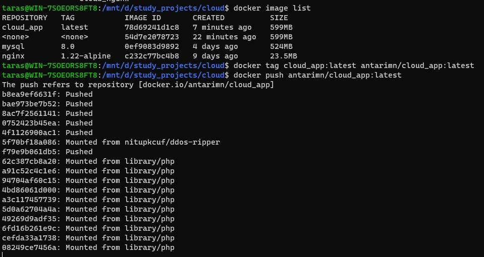
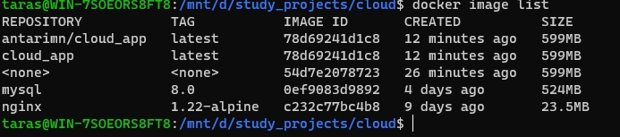
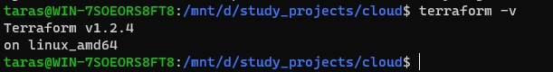
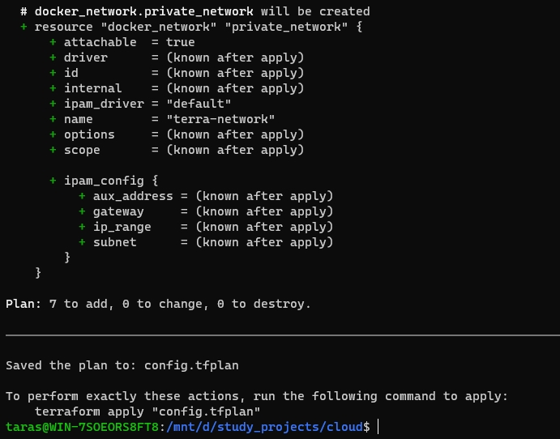
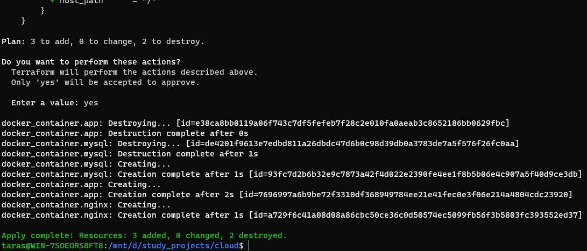
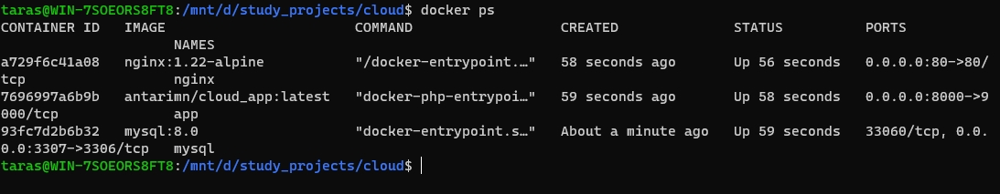

# Terraform

Push images to Docker Hub



Image pushed



Verify Terraform



main.tf
```dockerfile
terraform {
  required_providers {
    docker = {
      source  = "kreuzwerker/docker"
      version = "2.16.0"
    }
  }
}

provider "docker" {
  host = "unix:///var/run/docker.sock"
}

resource "docker_network" "private_network" {
  name       = "terra-network"
  attachable = true
}

resource "docker_image" "nginx" {
  name         = "nginx:1.22-alpine"
  keep_locally = false
}

resource "docker_container" "nginx" {
  image = docker_image.nginx.name
  name  = "nginx"
  volumes {
    container_path = "/var/www/html"
    host_path      = "/"
  }
  volumes {
    container_path = "/etc/nginx/nginx.conf"
    host_path      = "/.docker/dev/nginx/nginx.conf"
  }
  ports {
    internal = 80
    external = 80
  }
  networks_advanced {
    name = "${docker_network.private_network.name}"
  }
  depends_on = [docker_container.app]
}


resource "docker_image" "app" {
  name         = "antarimn/cloud_app:latest"
  keep_locally = false
}

resource "docker_container" "app" {
  image = docker_image.app.name
  name  = "app"
  ports {
    internal = 9000
    external = 8000
  }
  networks_advanced {
    name = "${docker_network.private_network.name}"
  }
  depends_on = [docker_container.mysql]
}

resource "docker_image" "mysql" {
  name         = "mysql:8.0"
  keep_locally = false
}

resource "docker_container" "mysql" {
  image = docker_image.mysql.name
  name  = "mysql"
  env   = [
    "MYSQL_DATABASE=cloud",
    "MYSQL_ROOT_PASSWORD=cloud_password",
    "MYSQL_PASSWORD=cloud_password",
    "MYSQL_USER=cloud_user"
  ]
  mounts {
    source = "/.docker/dev/mysql/"
    target = "/var/lib/mysql/"
    type = "bind"
  }
  ports {
    internal = 3306
    external = 3307
  }
  networks_advanced {
    name = "${docker_network.private_network.name}"
  }
}
```

Running **terraform plan**



Applying



Running containers


