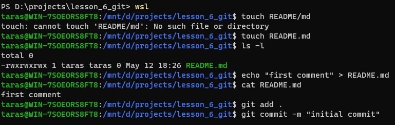
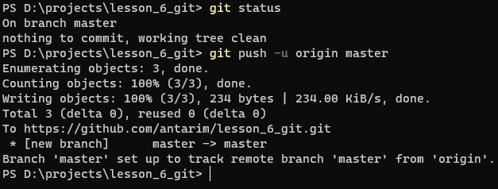
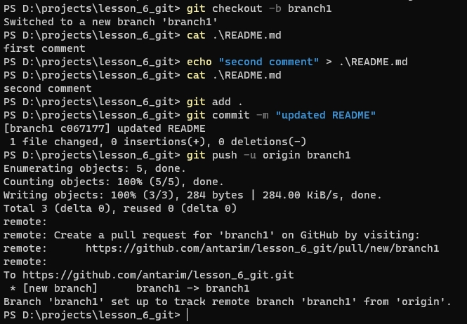
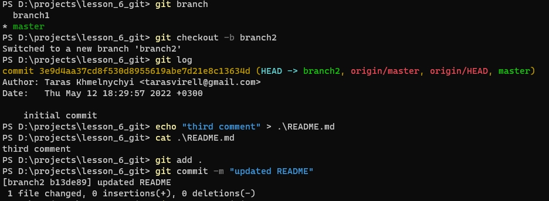
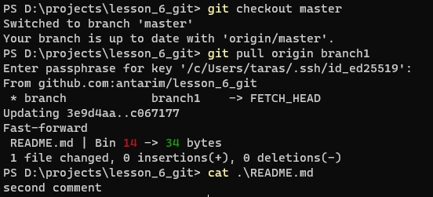
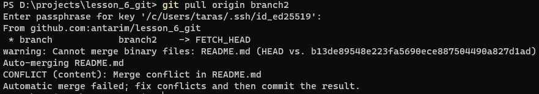
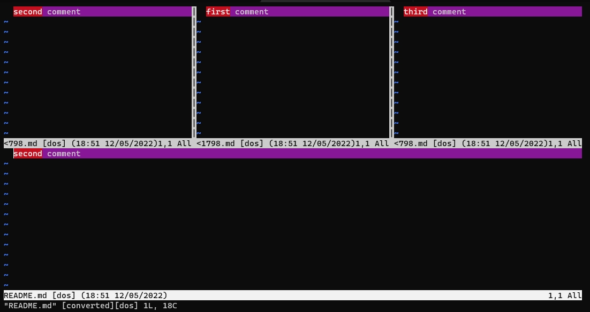
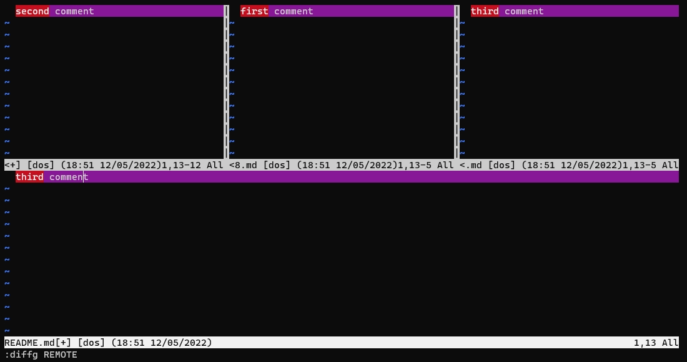
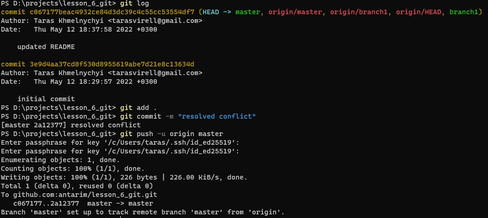
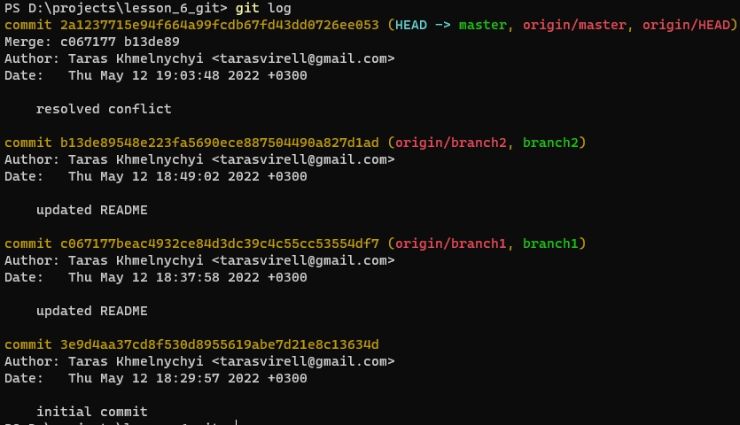

# Git

[Repo](https://github.com/antarim/lesson_6_git/tree/master) which was used

### Init git repo

### First push to origin

### Start new branch and push to origin

### Start second branch and push to origin

### Pull first branch into master

### Pull second branch into master to create merge conflict

### Resolve merge conflict using _vimdiff_

### Push resolved conflict to origin

### Git log after resolve

