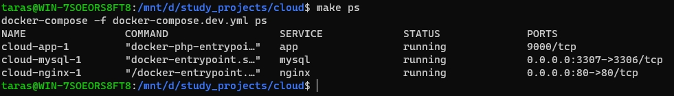
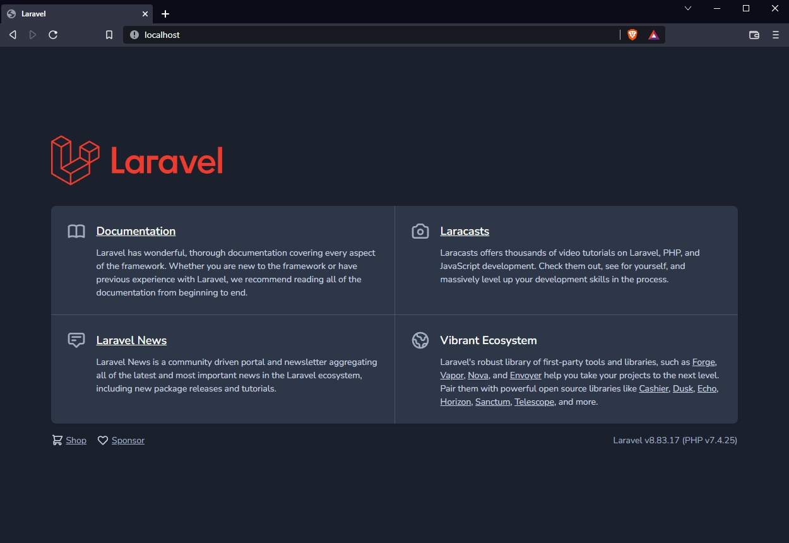

# Docker

Laravel application dockerfile
```dockerfile
FROM php:8.1-fpm

# Copy composer.lock and composer.json into the working directory
COPY composer.lock composer.json /var/www/html/

# Set working directory
WORKDIR /var/www/html/

# Install dependencies for the operating system software
RUN apt-get update && apt-get install -y \
    build-essential \
    libpng-dev \
    libjpeg62-turbo-dev \
    libfreetype6-dev \
    locales \
    zip \
    jpegoptim optipng pngquant gifsicle \
    vim \
    libzip-dev \
    unzip \
    git \
    libonig-dev \
    curl \
    && apt-get clean && rm -rf /var/lib/apt/lists/* \
    && docker-php-ext-install pdo_mysql mbstring zip exif pcntl \
    && docker-php-ext-configure gd --with-freetype --with-jpeg \
    && docker-php-ext-install gd \
    && curl -sS https://getcomposer.org/installer | php -- --install-dir=/usr/local/bin --filename=composer

# Copy existing application directory contents to the working directory
COPY . /var/www/html/

# Install composer dependencies
RUN composer install

# Dump composer autoload
RUN composer dump-autoload --optimize

# Assign permissions of the working directory to the www-data user
RUN chown -R www-data:www-data \
        /var/www/html/storage \
        /var/www/html/bootstrap/cache


# Expose port 9000 and start php-fpm server (for FastCGI Process Manager)
EXPOSE 9000
CMD ["php-fpm"]
```


docker-compose.yml
```yaml
version: '3.8'

services:
  nginx:
    build:
      context: ./
      dockerfile: ./.docker/dev/nginx/Dockerfile
    volumes:
      - ./.docker/dev/nginx/nginx.conf:/etc/nginx/nginx.conf:ro
    ports:
      - "80:80"
    networks:
      - gateway

  app:
    build:
      context: ./
      dockerfile: ./.docker/dev/app/Dockerfile
    volumes:
      - ./:/var/www/html
    links:
      - mysql
    hostname: api
    networks:
      - gateway
    restart: unless-stopped

  mysql:
    build:
      context: ./
      dockerfile: ./.docker/dev/mysql/Dockerfile
    environment:
      MYSQL_DATABASE: ${DB_DATABASE}
      MYSQL_ROOT_HOST: "%"
      MYSQL_ROOT_PASSWORD: ${DB_PASSWORD}
      MYSQL_PASSWORD: ${DB_PASSWORD}
      MYSQL_USER: ${DB_USERNAME}
    volumes:
      - mysql:/var/lib/mysql
      # - ./.docker/dev/mysql/dumps/:/tmp
    ports:
      - "${FORWARD_DB_PORT:-3307}:3306"
    networks:
      - gateway

volumes:
  mysql:
    driver: local

networks:
  gateway:
    name: gateway
    external: true
```

Nginx server configuration
```nginx configuration
server {
    listen 80;

    index index.php index.html;

    error_log  /var/log/nginx/error.log;
    access_log /var/log/nginx/access.log;

    root /var/www/html/public;

    location ~ \.php$ {
        try_files $uri =404;
        fastcgi_split_path_info ^(.+\.php)(/.+)$;
        fastcgi_pass laravel:9000;
        fastcgi_index index.php;
        include fastcgi_params;
        fastcgi_param SCRIPT_FILENAME $document_root$fastcgi_script_name;
        fastcgi_param PATH_INFO $fastcgi_path_info;
    }

    location / {
        try_files $uri $uri/ /index.php?$query_string;
        gzip_static on;
    }
    
    location ~ /\.ht {
        deny all;
    }
}
```

Makefile snippet
```makefile
# Include file with .env variables if exists
-include .env

# Define default values for variables
COMPOSE_FILE ?= docker-compose.yml

#-----------------------------------------------------------
# Management
#-----------------------------------------------------------

# Create shared gateway network
gateway:
	docker network create gateway

# Init variables for development environment
env.dev:
	cp ./.env.dev ./.env

# Init variables for production environment
env.prod:
	cp ./.env.prod ./.env

# Build and restart containers
install: build up

# Start containers
up:
	docker-compose -f ${COMPOSE_FILE} up -d

# Stop containers
down:
	docker-compose -f ${COMPOSE_FILE} down --remove-orphans

# Build containers
build:
	docker-compose -f ${COMPOSE_FILE} build

# Show list of running containers
ps:
	docker-compose -f ${COMPOSE_FILE} ps

# Restart containers
restart:
	docker-compose -f ${COMPOSE_FILE} restart
	
#... app related commands
```

docker containers running


Laravel application running
